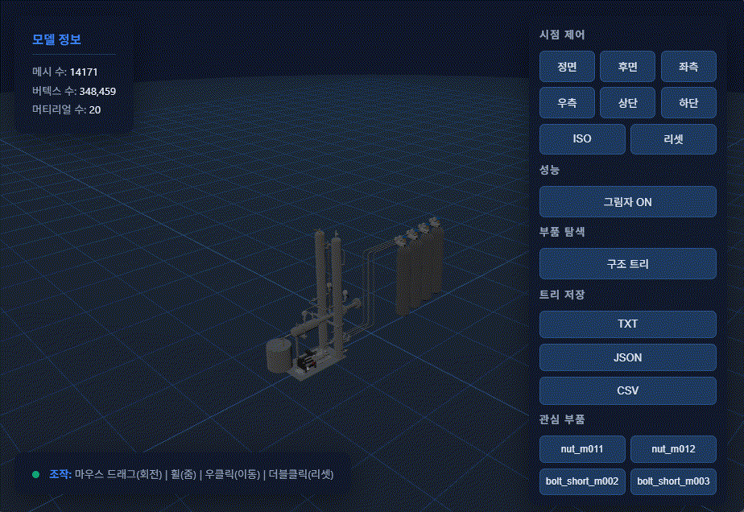
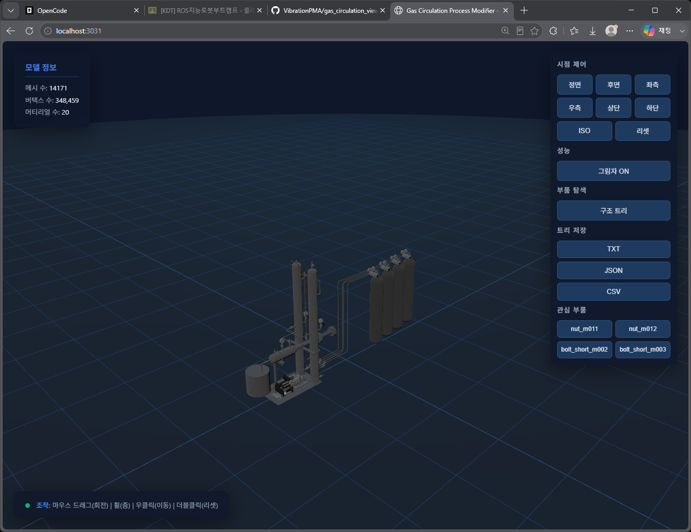
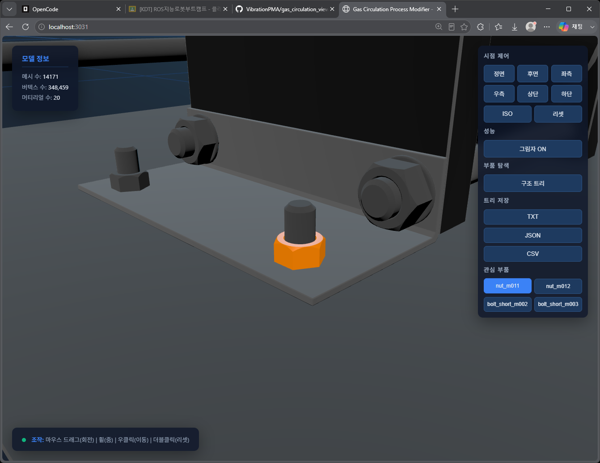
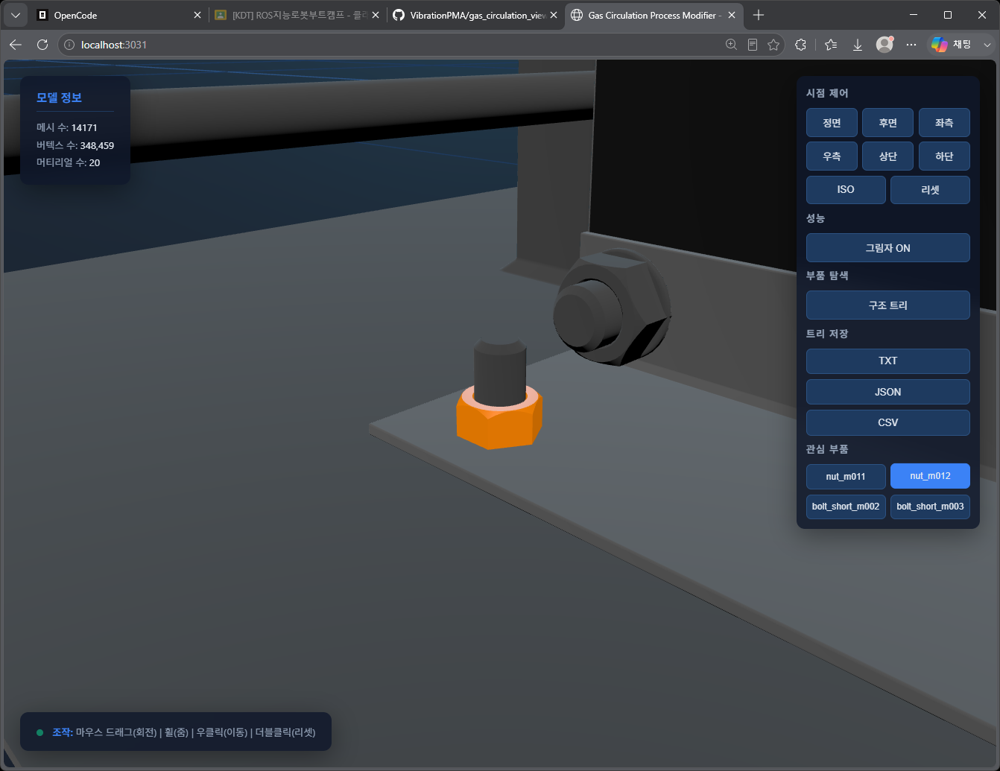
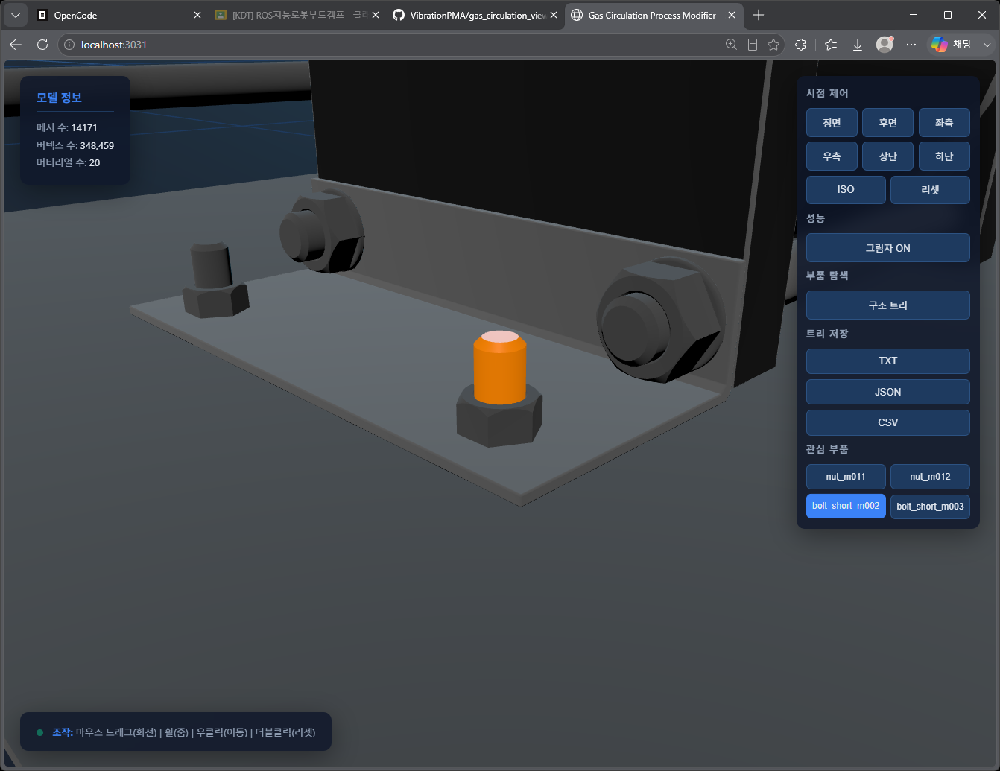
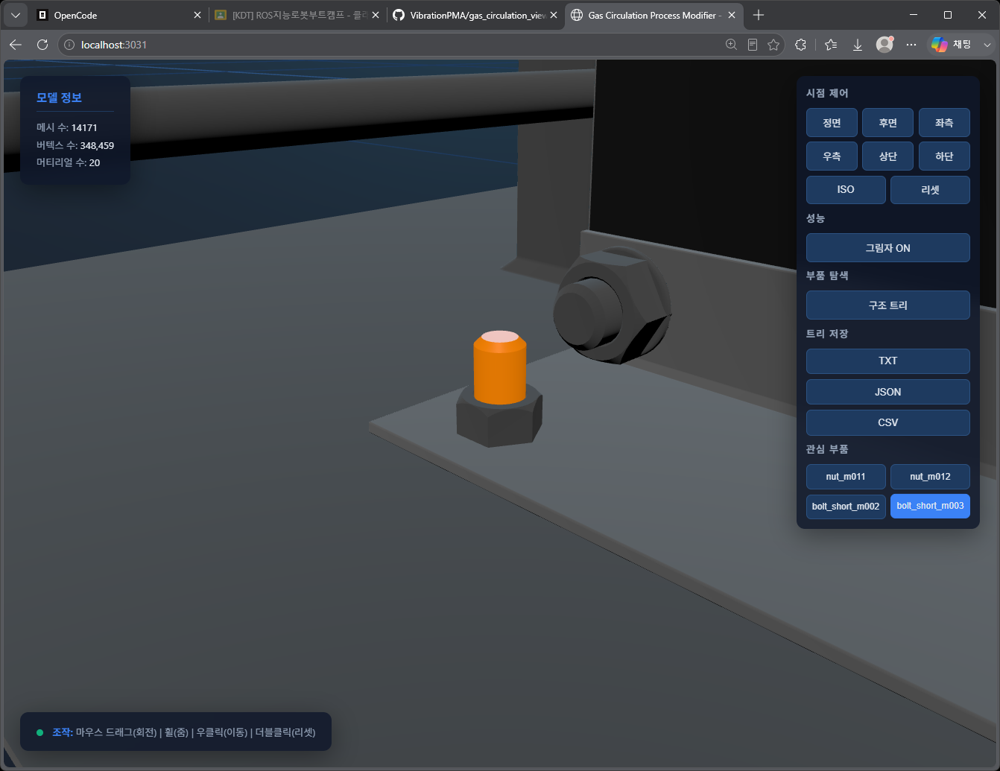

# Gas Circulation Process Modifier — 3D Viewer (1차 완료)

> **프로젝트 위치:** `C:\Users\Administrator\Desktop\gas_circulation_viewer\`
> **대상 모델:** 동일 폴더 내 `gas_circulation_process_modifier.glb` (약 6.72MB)
> **실행:** `npm start` → 브라우저 `http://localhost:3031/`

---

## 1. 프로젝트 개요

가스 순환 공정 장비(`gas_circulation_process_modifier`)의 **STEP → GLB** 변환 모델을 웹브라우저에서 실시간 3D로 조회하기 위한 Three.js 뷰어입니다.

- GLB는 CORS 제약으로 `file://` 직접 열기가 불가 → **Node.js 정적 파일 서버**로 서빙
- 구현 기능: **좌표계(Z-up) 정렬, 빠른 조작감, 온디맨드 렌더링, 구조 트리, 부품 줌인 + 전체 색상 강조, 트리 파일 저장(TXT/JSON/CSV)**
- 최종 목표(다음 단계): 외부 인터페이스에서 부품명을 받아 해당 부품으로 자동 줌인 + 강조













---

## 2. 디렉토리 구성 (새 구조)

```
Desktop\gas_circulation_viewer\
├── package.json                  ← npm 실행 스크립트
├── server.js                     ← 정적 파일 서버 (포트 3031)
├── index.html                    ← Three.js 뷰어 전체 (단일 파일)
├── gas_circulation_process_modifier.glb   ← 대상 모델
└── README.md                     ← 이 문서
```

> 이전 구조(`Tesla_Control_UI/gas_circulation_viewer/`)에서 이 위치로 옮겨졌으며
> `index.html`·`server.js`·GLB를 **한 폴더에 배치**해 바로 실행됩니다.

---

## 3. 초기 설정 & 실행

### 3-1. 요구 사항
- Node.js (런타임만 필요 — npm 패키지 설치 불필요, `three.js`는 CDN 사용)

### 3-2. 실행

```powershell
cd C:\Users\Administrator\Desktop\gas_circulation_viewer
npm start            # 또는 npm run server.js  (둘 다 node server.js 실행)
```

**접속:** `http://localhost:3031/`  (네트워크 타 PC는 서버 콘솔에 표시된 IP로 접속)

### 3-3. 주의 사항
- `file://`로 `index.html`을 직접 열지 말 것 (GLB CORS 오류)
- 코드(GLB 포함)를 수정한 뒤엔 **서버 재시작 + 브라우저 Ctrl+F5**(캐시 방지용 `Cache-Control: no-store` 설정됨)
- 포트 3031 사용 중이면 `server.js`의 `PORT` 변경

---

## 4. 모델 분석 결과

> three.js(r159) GLTFLoader 기준으로 RAW glTF 노드와 실제 씬 그래프 두 층을 구분해 파악해야 합니다.

### 4-1. RAW glTF (GLB 바이너리 JSON)
- 노드 284개, 메시 265개, 재질 20개(`mat_0`~`mat_19`), 씬 1개
- 관심 부품 4개는 RAW에서 `mesh=true, children=0` (단일 노드):
  - `nut_m011` (노드 278), `nut_m012` (노드 280)
  - `bolt_short_m002` (노드 277), `bolt_short_m003` (노드 279)
- 루트 노드 이름은 인코딩 쓰레기(`\X2\ACF5...\X0\`) → 트리/파일에서 정리

### 4-2. 실제 씬 그래프 (three.js 로드 후)
`GLTFLoader`가 **다중 primitive 메시를 `Group` + 자식 `Mesh`로 분해**하며 자식 이름 `기본이름_NN`을 매깁니다.

```
nut_m012 (Group)                            ← 선택 대상 (12개 자식)
├─ nut_m12_61  Mesh (59v)   mat_1
├─ nut_m12_62  Mesh (58v)   mat_1
├─ nut_m12_63  Mesh (35v)   mat_1
├─ nut_m12_64  Mesh (59v)   mat_1
├─ nut_m12_65  Mesh (63v)   mat_1
├─ nut_m12_66  Mesh (96v)   mat_1
└─ nut_m12_67~72 Mesh (13v) mat_1 (6개)
```

| 관심 부품 | 실제 자식 구조 |
|---|---|
| `nut_m011` | `nut_m12_49` ~ `nut_m12_60` (12개 Mesh) |
| `nut_m012` | `nut_m12_61` ~ `nut_m12_72` (12개 Mesh) |
| `bolt_short_m002` | `bolt_short_m12_25` ~ `bolt_short_m12_36` (12개 Mesh) |
| `bolt_short_m003` | `bolt_short_m12_37` ~ `bolt_short_m12_48` (12개 Mesh) |

> 이 발견이 "부품 일부만 색칠되는 버그"의 근본 원인 — 10절 참고

---

## 5. index.html — 아키텍처

### 5-1. importmap (three r159)
```html
<script type="importmap">
{ "imports": {
  "three": "https://cdn.jsdelivr.net/npm/three@0.159.0/build/three.module.js",
  "three/addons/": "https://cdn.jsdelivr.net/npm/three@0.159.0/examples/jsm/"
}}
</script>
```

### 5-2. 좌표계 변환 체인 (Z-up 정렬)
```js
model.rotation.y = Math.PI;              // ① 상하 반전
modelInner = new THREE.Group();
modelInner.rotation.z = -Math.PI;        // ② 수평 -180° (사용자 요구)
modelWrapper = new THREE.Group();
modelWrapper.rotation.x = -Math.PI / 2;  // ③ Z-up 전환
// 계층: scene → modelWrapper(X -90°) → modelInner(Z -180°) → model(Y 180°)
```

### 5-3. 성능 최적화
| 항목 | 값 | 이유 |
|---|---|---|
| 렌더링 | 온디맨드 (`needsRender`) | 씬 고정 → 요청 시에만 렌더 |
| `pixelRatio` | `min(devicePixelRatio, 1.5)` | 고해상도 모니터 안정성 |
| 그림자 | 기본 OFF + 토글 버튼 | 성능 |
| OrbitControls | rotate 1.5 / pan 1.6 / zoom 1.5 | 빠른 조작감 |
| `minDistance` | `maxDim * 0.05` | 작은 부품 줌인 허용 |

### 5-4. 렌더 루프
```js
let needsRender = true;
controls.addEventListener('change', () => { needsRender = true; });
function animate() {
  animFrameId = requestAnimationFrame(animate);
  controls.update();
  if (needsRender) { needsRender = false; renderer.render(scene, camera); }
}
```

### 5-5. 모델 로딩 & 피팅
```js
function fitModelToView(obj) {
  const box = new THREE.Box3().setFromObject(obj);
  const center = box.getCenter(new THREE.Vector3());
  const size   = box.getSize(new THREE.Vector3());
  const maxDim = Math.max(size.x, size.y, size.z);
  obj.position.x -= center.x; obj.position.z -= center.z;  // 수평 중앙
  obj.position.y -= box.min.y;                             // 바닥(y=0) 정렬
  const distance = maxDim * 2.2;
  homeCameraPos = new THREE.Vector3(distance*0.7, distance*0.6, distance*0.7);
  homeTarget    = new THREE.Vector3(0, maxDim*0.35, 0);
  ...
}
```

---

## 6. 구조 트리

- **「부품 탐색 → 구조 트리」** 버튼으로 열기/닫기 (on-demand, 첫 열 때만 빌드)
- `<details>/<summary>` 접이식 트리 — 메시 리프 `◈ 이름 (버텍스수v)`, 그룹 `▸ 이름 (자식수)`
- `cn()`으로 `\X2\...\X0\` 인코딩 이름 정리, 빈 그룹은 `hasMeshDescendant()` 필터
- **그룹(summary) 클릭 → 전체 부품 하이라이트**, 메시 리프 클릭 → 해당 조각 하이라이트
- `nut_m012`를 펼치면 자식 `nut_m12_61`~`nut_m12_72` 표시

---

## 7. 부품 선택 → 줌인 + 전체 색상 강조 (핵심)

### 7-1. 자식 메시 전부 수집
```js
function collectMeshes(obj) {
  if (obj.isMesh) return [obj];                    // 단일 메시
  const meshes = [];
  obj.traverse(c => { if (c.isMesh) meshes.push(c); }); // 그룹 → 자식 전부
  return meshes;
}
```

### 7-2. 선택 + 강조 + 복원
```js
let selectedMeshes = [];
function selectPart(obj, el) {
  clearHighlight();
  const meshes = collectMeshes(obj);
  selectedMeshes = meshes;
  if (el) { selectedEl = el; el.classList.add('selected'); }
  meshes.forEach(highlightMesh);   // 전부 주황색 재질로 교체
  focusOn(obj);                    // 전체 범위로 줌
}
function highlightMesh(mesh) {
  mesh.userData._origMaterial = mesh.material;          // 복원용 원본 저장
  mesh.material = new THREE.MeshStandardMaterial({      // 완전 단색 교체
    color: 0xff8800, emissive: 0xff8800, emissiveIntensity: 0.35,
    metalness: 0.1, roughness: 0.4
  });
}
function clearHighlight() {  /* selectedMeshes 각각 _origMaterial로 복원 + 클래스 제거 */ }
```

> 단색 재질로 **전체 교체**해야 텍스처 때문에 일부 표면만 물드는 문제가 없습니다.

### 7-3. 고성능 자동 줌 (ease-out 500ms)
```js
function focusOn(obj) {
  const box = new THREE.Box3().setFromObject(obj);
  const center = box.getCenter(...), size = box.getSize(...);
  const dist = Math.max(size.x, size.y, size.z, 0.05) * 3;
  const camDir = camera.position.clone().sub(controls.target).normalize();
  animateCamera(camera.position.clone(), controls.target.clone(),
                center.clone().add(camDir.multiplyScalar(dist)), center);
}
```

### 7-4. 이름 기반 검색
```js
function findPart(name) {
  let obj = model.getObjectByName(name);              // ① 정확 매칭
  if (!obj) model.traverse(o => {                     // ② 정제 이름 폴백
    if (!obj && cn(o.name) === name) obj = o;
  });
  return obj && collectMeshes(obj).length ? obj : null;
}
function focusPartByName(name) { const o = findPart(name); o ? selectPart(o, null) : console.warn(...); }
```
**`focusPartByName(name)`은 향후 외부 인터페이스 연동 시 재사용할 확장 포인트입니다.** 「관심 부품」 버튼 4개(`nut_m011`, `nut_m012`, `bolt_short_m002`, `bolt_short_m003`)가 이 함수를 호출합니다.

---

## 8. 트리 파일 저장 (TXT / JSON / CSV)

「트리 저장」 그룹의 버튼이 `Blob` + `URL.createObjectURL` + `<a download>`로 다운로드합니다.

| 버튼 | 파일 | 내용 |
|---|---|---|
| TXT | `gas_circulation_structure.txt` | 들여쓰기 계층 + 버텍스/재질 (사람용) |
| JSON | `gas_circulation_structure.json` | 중첩 `children[]` + `summary` (파싱용) |
| CSV | `gas_circulation_structure.csv` | 부품명/전체경로/타입/버텍스/재질 (Excel용) |

CSV는 `csvEscape()`로 `,`·`"`·개행 포함 이름(`+_shape_adaptor` 등)을 안전하게 처리합니다.

---

## 9. 서버 (server.js)

- 포트 `3031`, 루트 = **`__dirname`(= 프로젝트 폴더)** — `/` 접속 시 `/index.html` 서빙
- GLB(`model/gltf-binary`) 포함 MIME 매핑, `path.resolve`로 경로 탈출 403 차단
- **512KB 이상 파일 스트리밍** (`fs.createReadStream`) — 6.72MB GLB 지연 방지
- `Cache-Control: no-store` — 개발 중 항상 최신 파일 확보
- 연결 추적 Set + `closeAllConnections()` + 5초 강제 종료 fallback (SIGINT/SIGTERM)
- 실행 시 로컬/네트워크 IP, 루트 경로, 초기 메모리를 콘솔 출력

---

## 10. 트러블슈팅 기록

| 이슈 | 원인 | 해결 |
|---|---|---|
| `file://` 로 안 열림 | GLTFLoader fetch → CORS | Node 정적 서버로 서빙 |
| 모델 위아래 뒤집힘 | STEP Y-up vs 장비 | 변환 체인 `y=π → z=-π → x=-π/2` |
| 렌더링 느림 | 매 프레임 렌더 | 온디맨드 렌더링 + 픽셀비율/조명 최적화 |
| 그림자 프레임 드랍 | 셰도우 맵 비용 | 기본 OFF + 토글 버튼 |
| Ctrl+C로 서버 안 죽음 | keep-alive 소켓 | `closeAllConnections()` + 강제 종료 fallback |
| **부품 일부만 주황색** | GTFLoader가 다중 primitive를 Group+자식 12개로 분해 → 첫 자식만 색칠됨 | `collectMeshes()`로 **자식 전부** 수집해 전체 강조/복원 |
| 변경이 브라우저에 미반영 | HTML 캐시 | `Cache-Control: no-store` + 서버 재시작 + Ctrl+F5 |

---

## 11. 사용법 요약

| 동작 | 방법 |
|---|---|
| 회전 / 줌 / 이동 | 좌클릭 드래그 / 휠 / 우클릭 드래그 |
| 초기 시점 | 더블클릭 또는 「리셋」 |
| 방향 | 정면/후면/좌/우/상/하/ISO |
| 부품 구조 보기 | 「부품 탐색 → 구조 트리」 |
| 부품 강조 | 트리에서 클릭 또는 「관심 부품」 버튼 |
| 하이라이트 해제 | 다른 부품 선택 시 자동 |
| 트리 저장 | TXT / JSON / CSV 버튼 |

---

## 12. 향후 개선 (2차 계획)

1. **외부 인터페이스 연동** — HTTP 엔드포인트(예: `POST /focus { part: "nut_m011" }`) + 폴링 → `focusPartByName()` 재사용
2. 부품명 매핑 테이블 — FreeCAD(STEP) 이름 ↔ GLB 씬 이름
3. 하이라이트 색상 커스터마이징, 다중 부품 동시 강조
4. 외부 상태(경고/에러)에 따른 색 구분

---

*문서 갱신일: 2026-09-10 · 갱신: 새 위치(`Desktop\gas_circulation_viewer`) 기준 초기 설정 정비*
